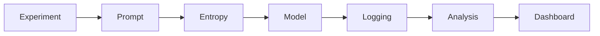
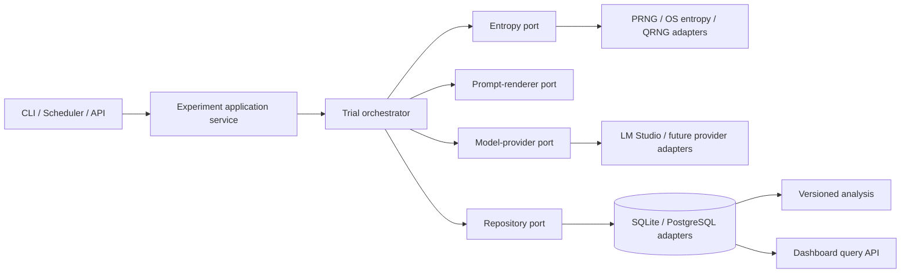

# Entropy Research Platform

A reproducible Python platform for controlled LLM experiments. The platform is domain-agnostic: entropy source is one explicitly recorded experimental factor, not an explanation for any particular result.

## Conceptual experiment pipeline

The documentation retains the research-facing pipeline from the project brief. Internally, its responsibilities are implemented through ports and adapters so logging, provenance, and analysis are not accidentally treated as sequential steps.

## Internal architecture

## Scientific records

- **Hypothesis Registry:** hypotheses are versioned and registered before an experiment starts. Plans pin an ID, revision, and content hash.
- **Observer:** each human, automated evaluator, or system agent has a durable identity. Human reviews and automated assessments are `Observation` records attributed to an observer.
- **Trial:** the atomic execution unit: one rendered prompt, one entropy sample, one model request, and one response or recorded failure.
- **Provenance:** plans are immutable Pydantic records with a canonical config hash; model capabilities and the entropy-application policy are recorded.

Raw entropy bytes are held in memory to derive a seed and are excluded from the
durable trial JSON. A production artifact-store adapter should retain them only
when an explicit retention policy permits it; durable records always retain a
hash and provenance.

See [the architecture guide](docs/architecture.md) for the component, class,
sequence, and database diagrams.
