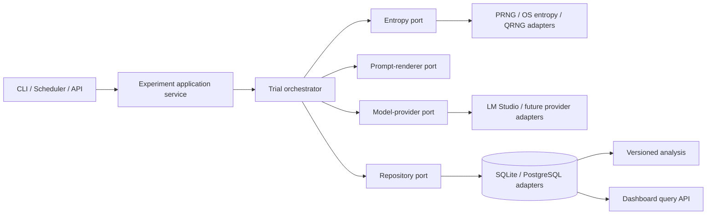

# Entropy Research Platform

A local, reproducible scientific operating system for controlled LLM experiments. The platform is domain-agnostic: entropy is an explicitly recorded experimental factor, not an explanation for any particular result.

## Local overnight MVP

### Supported interpreter

The platform requires **Python 3.11 or newer**. On this host, use
`/usr/bin/python` (currently Python 3.13); a pyenv-managed `python` may resolve
to an unsupported interpreter. Set the command once per shell:

```bash
export ERP_PYTHON=/usr/bin/python
export PYTHONPATH=.
"$ERP_PYTHON" --version
```

The supported local workflow registers every experimental input before work begins, creates one immutable experiment revision, performs sequential/resumable attempts, derives only descriptive evidence, and exposes it through a read-only workspace.

1. Copy and edit [`config/experiments/overnight.json`](config/experiments/overnight.json). Replace the LM Studio model identifier and its actual SHA-256 artifact hash. Keep the two conditions identical except for their registered entropy source.
2. Start LM Studio locally with that model loaded. The adapter uses `http://127.0.0.1:1234/v1` by default.
3. Validate and register (use a new database path for a fresh study):

   ```bash
   "$ERP_PYTHON" main.py --database database/overnight.db experiment validate config/experiments/overnight.json
   "$ERP_PYTHON" main.py --database database/overnight.db experiment register config/experiments/overnight.json
   ```

4. Copy the printed `id:revision:hash` reference, then preflight and run:

   ```bash
   "$ERP_PYTHON" main.py --database database/overnight.db experiment preflight <experiment-ref>
   "$ERP_PYTHON" main.py --database database/overnight.db run start <experiment-ref> --idempotency-key overnight-001
   ```

5. Inspect or resume the same run without duplicating successful trial slots:

   ```bash
   "$ERP_PYTHON" main.py --database database/overnight.db run status <run-id>
   "$ERP_PYTHON" main.py --database database/overnight.db run resume <run-id> --experiment <experiment-ref>
   "$ERP_PYTHON" main.py --database database/overnight.db analyze baseline <run-id>
   "$ERP_PYTHON" main.py --database database/overnight.db workspace serve
   ```

The workspace binds only to `127.0.0.1:8765`. It is read-only and never starts or controls experiments.

Use `export blind` before reviewing condition-specific results and retain `export reveal-map` separately:

```bash
"$ERP_PYTHON" main.py --database database/overnight.db export blind <experiment-ref> exports/blinded.json
"$ERP_PYTHON" main.py --database database/overnight.db export reveal-map <experiment-ref> exports/reveal-map.json
```

### Important limitations and safety

- `os.urandom` is recorded as **operating-system entropy**. It is not presented as a claim of true, hardware, or quantum randomness.
- LM Studio's seed parameter is best-effort. A recorded seed is not a guarantee of deterministic output across runtime/model versions.
- Raw entropy is deliberately not persisted. Source configuration must not include secrets; sensitive values must be `$env:NAME` references.
- SQLite, reports, and reveal maps can contain research data. The default `.gitignore` excludes them. Keep databases and exports on trusted local storage and back them up intentionally.
- The sample configuration is a protocol template, not scientific evidence and not a claim about PRNG/OS-entropy outcomes.

## Conceptual experiment pipeline

The documentation retains the research-facing pipeline from the project brief. Internally, its responsibilities are implemented through ports and adapters so logging, provenance, and analysis are not accidentally treated as sequential steps.


## Internal architecture



## Scientific records

- **Hypothesis Registry:** hypotheses are versioned and registered before an experiment starts. Plans pin an ID, revision, and content hash.
- **Observer:** each human, automated evaluator, or system agent has a durable identity. Human reviews and automated assessments are `Observation` records attributed to an observer.
- **Trial:** the atomic execution unit: one rendered prompt, one entropy sample, one model request, and one response or recorded failure.
- **Provenance:** plans are immutable Pydantic records with a canonical config hash; model capabilities and the entropy-application policy are recorded.

Raw entropy bytes are held in memory to derive a seed and are excluded from the
durable trial JSON. A production artifact-store adapter should retain them only
when an explicit retention policy permits it; durable records always retain a
hash and provenance.

See [the architecture guide](docs/architecture.md) for the component, class,
sequence, and database diagrams.

The [reproducibility contract](docs/reproducibility-contract.md) defines the
immutable execution provenance required for every recorded trial.

The [control-plane model](docs/control-plane.md) defines explicit operational
lifecycle, retries, idempotency, and the separation from scientific evidence.

The [Entropy Policy System](docs/entropy-policy-system.md) documents the
registered, seed-only entropy transformation used by current trials.

The [technical specification](docs/technical-specification.md) is the canonical
reference for the currently implemented platform.

The [Evidence and Analysis Plane](docs/evidence-and-analysis.md) documents the
implemented deterministic baseline analysis subsystem.

The [Investigation Workspace](docs/investigation-workspace.md) documents the
read-only, evidence-oriented workspace skeleton.

The [Local Overnight MVP guide](docs/local-overnight-mvp.md) defines the
registered-input, preflight, resume, blind-export, and local-security workflow.

The [fixed-continuation conversation protocol](docs/conversation-pilot.md)
defines the persisted chat lineage and context-rejection rule for the separate
conversation pilot.

The `analysis`, `api`, `dashboard`, `reports`, and non-LM-Studio provider
directories are deferred placeholders; they are not implemented subsystems.
