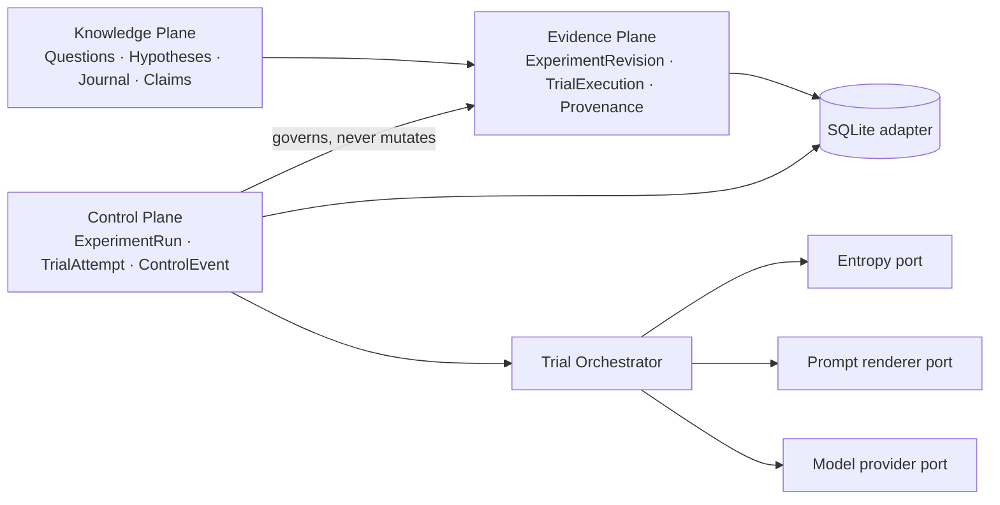
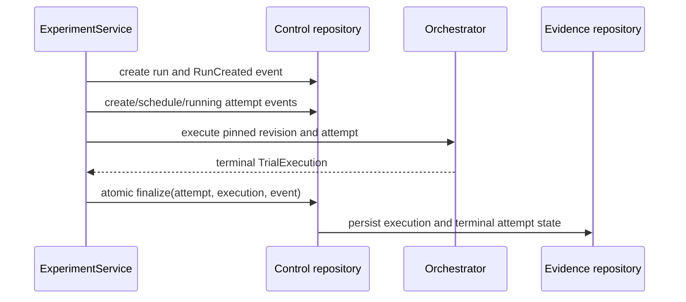

# Architecture

The platform separates immutable scientific meaning from operational execution.

`ExperimentPlan` is a construction DTO. Registration creates an immutable,
revisioned `ExperimentRevision`, which pins the hypothesis and trial protocol.
An `ExperimentRun` references that revision and owns operational state. Each
`TrialAttempt` records scheduling and retry lineage. Terminal attempts produce
one immutable `TrialExecution` in the same transaction as their final state
transition.

Scientific records and their audit events are revision-pinned. Control events
are a separate append-only operational history. The analysis, API, dashboard,
reporting, and provider-expansion packages are deferred placeholders and are
not active architecture.
