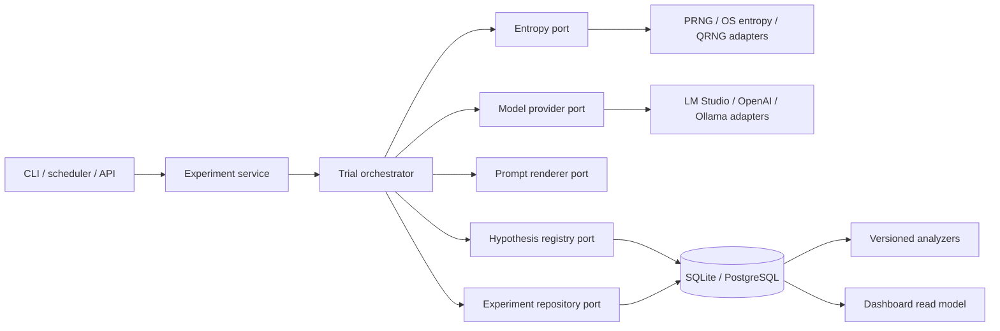
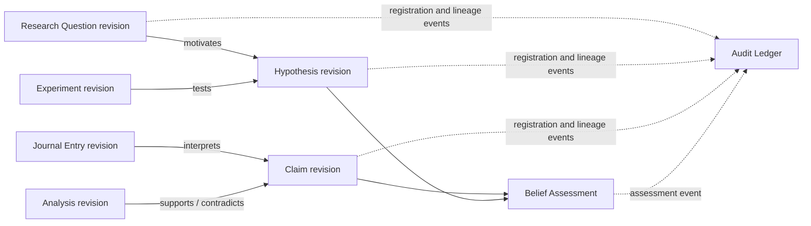
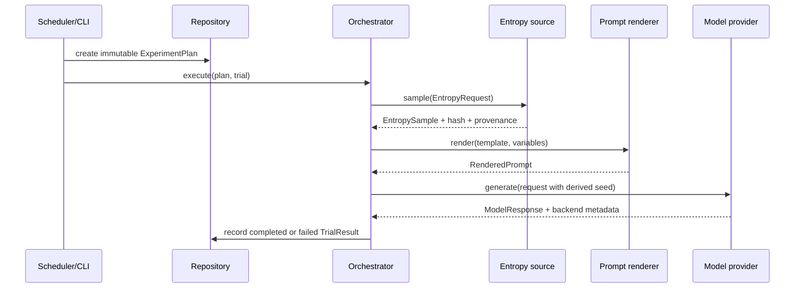
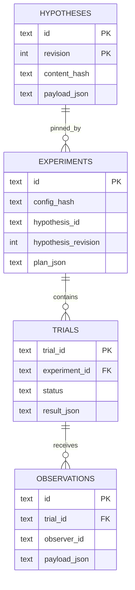

# Architecture

## Conceptual pipeline

The research workflow remains intentionally simple: **Experiment → Prompt →
Entropy → Model → Logger → Analysis → Dashboard**. It is a conceptual view,
not a dependency graph. The internal design keeps its components independently
testable and allows logging and analysis to operate across the workflow.

## Ports-and-adapters implementation

## Scientific record model

Before an experiment can be executed, its intellectual context is represented
by immutable, revision-pinned records. Each registration, relation, and belief
assessment produces an append-only audit event in the same transaction.

See [the scientific record model](scientific-record-model.md) for its scope and
admission criterion.

## Core class relationships

```mermaid
classDiagram
    class ExperimentPlan { +config_hash() str }
    class Hypothesis { +id UUID +revision int +content_hash() str }
    class HypothesisReference { +hypothesis_id UUID +revision int +content_hash str }
    class Observer { +id UUID +kind ObserverKind }
    class TrialSpec { +ordinal int +entropy EntropyRequest }
    class TrialOrchestrator { +execute(plan, trial) TrialResult }
    class EntropyPort { <<interface>> +sample(request) EntropySample }
    class PromptRendererPort { <<interface>> +render(template, variables) RenderedPrompt }
    class ModelProviderPort { <<interface>> +generate(request) ModelResponse }
    class ExperimentRepositoryPort { <<interface>> +record_trial(result) }
    class HypothesisRegistryPort { <<interface>> +register(hypothesis) HypothesisReference }
    ExperimentPlan --> HypothesisReference
    ExperimentPlan --> Observer
    ExperimentPlan --> TrialSpec
    TrialOrchestrator --> EntropyPort
    TrialOrchestrator --> PromptRendererPort
    TrialOrchestrator --> ModelProviderPort
    TrialOrchestrator --> ExperimentRepositoryPort
    HypothesisRegistryPort --> Hypothesis
```

## Trial execution sequence

## Database model

`observers` are embedded in the immutable plan for provenance and linked from
their separate `Observation` records. A future observer directory may be added
as a repository concern without changing the trial domain.
