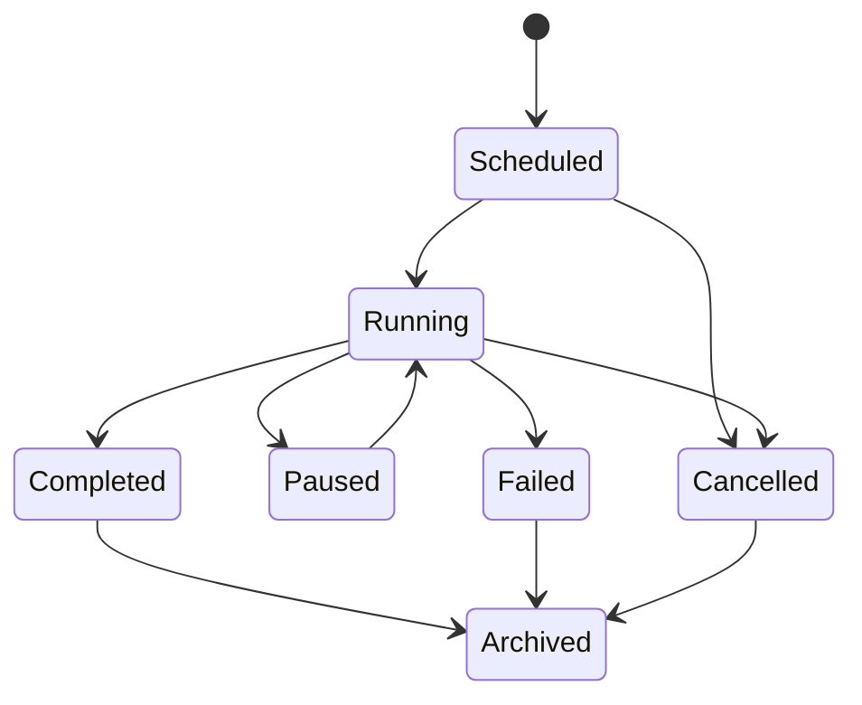

# Experiment Control Plane

The control plane governs execution without changing scientific records.

`ExperimentPlan` is validated and promoted to an immutable `ExperimentRevision`.
An `ExperimentRun` then pins that revision, a retry-policy snapshot, scheduler,
actor, and idempotency key. It owns mutable operational state only.

Each scheduled unit is a `TrialAttempt`. Retrying creates a new attempt with a
predecessor link; it never overwrites a failed attempt. A terminal attempt
produces an immutable `TrialExecution` carrying run/attempt IDs, number, and
idempotency key.

Every creation and state transition writes an append-only `ControlEvent` in the
same database transaction. The inline scheduler is deterministic and intended
for local execution/tests; production queue adapters can implement the same
`Scheduler` port without changing control records.
