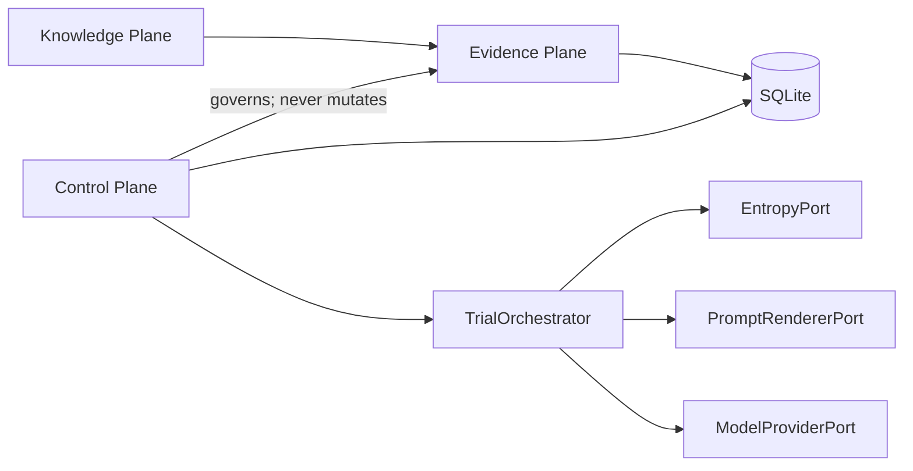
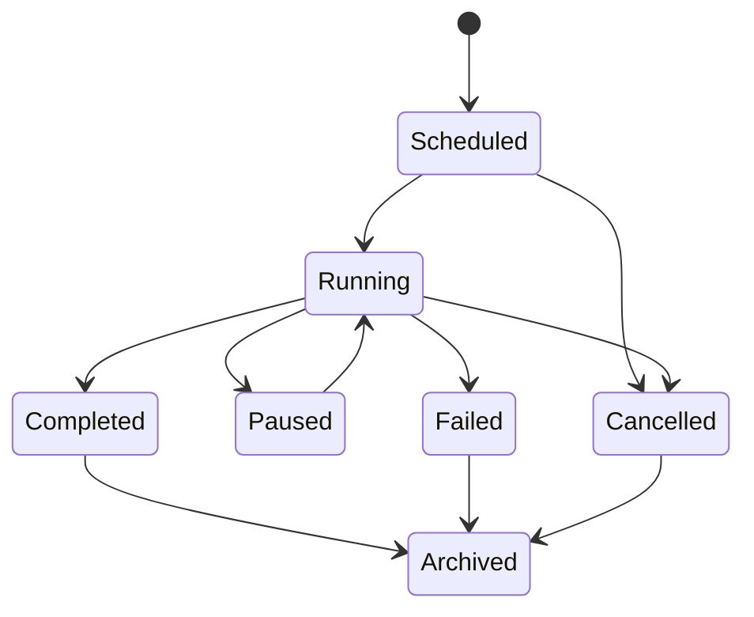
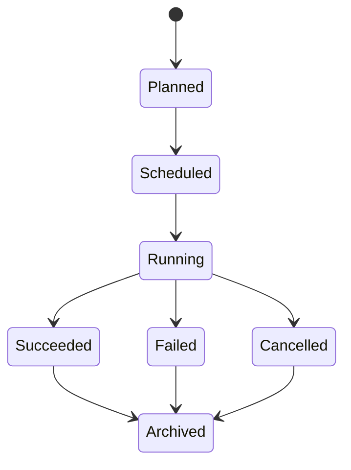
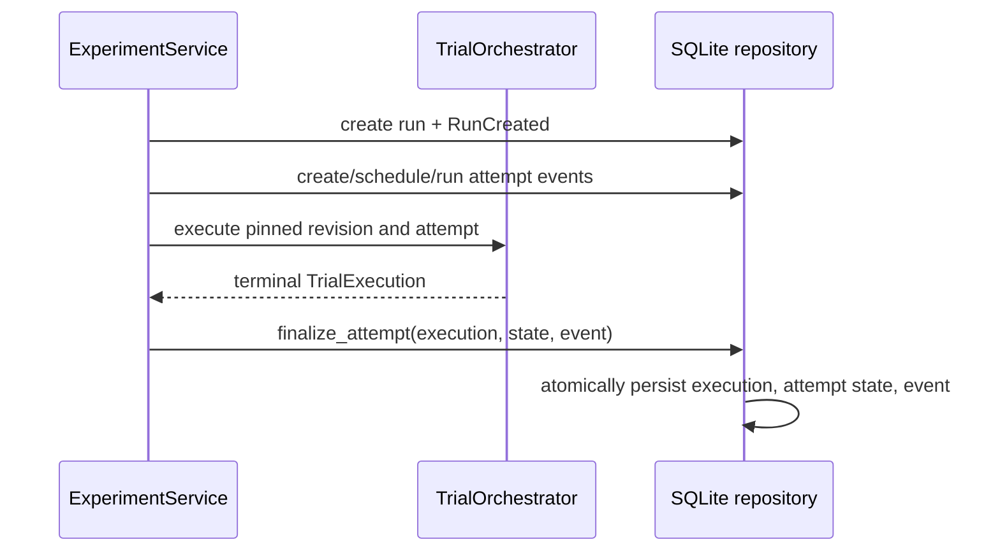
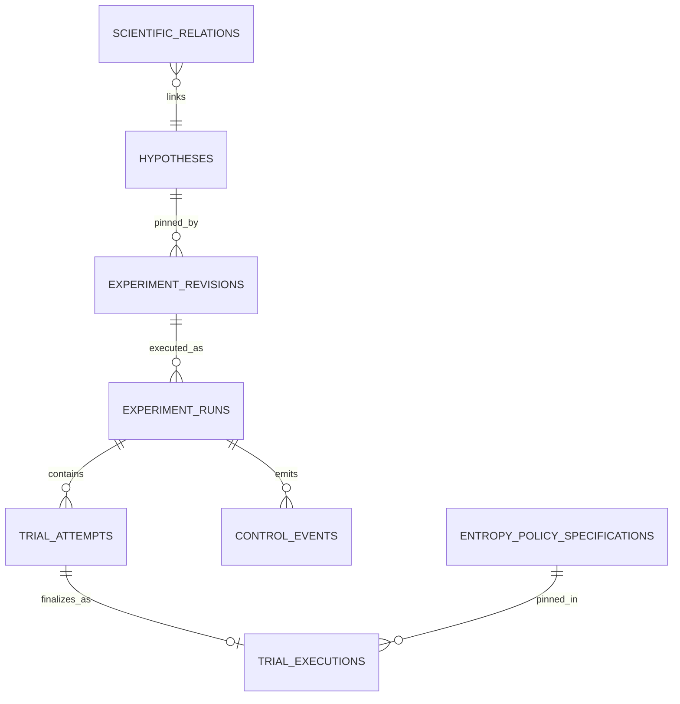

# Entropy Research Platform — Technical Specification

**Status:** canonical description of the implementation as of Milestones 0–3.

## Purpose and admission criterion

The platform is a Python research framework for controlled LLM experiments. It
is domain-agnostic: entropy is a recorded experimental factor, not an
explanation for results. A new domain concept is admitted only if omitting it
makes a future scientific question impossible or significantly harder to answer
for provenance, audit, reproducibility, or interpretation.

## Architecture

- **Knowledge:** research questions, hypotheses, journal entries, claims,
  external references, relations, belief assessments, audit events.
- **Evidence:** immutable experiment revisions, terminal trial executions,
  provenance snapshots, artifacts, entropy applications.
- **Control:** experiment runs, trial attempts, lifecycle transitions, retries,
  idempotency, control events, scheduling.

Core owns ports in `core.interfaces`; adapters implement them in `entropy/`,
`models/`, `prompts/`, `runner/`, and `database/`. Domain records do not depend
on adapters.

## Domain and scientific model

All persistent scientific records are immutable Pydantic `FrozenModel` values.
`ScientificRecordReference` pins type, UUID, revision, and SHA-256 content hash.
Revisioned records pin their immediate predecessor.

| Concept | Meaning |
|---|---|
| ResearchQuestion | Durable research question and rationale. |
| Hypothesis | Versioned, preregisterable claim with predictions, criteria, and alternatives. |
| JournalEntry | Versioned idea, rationale, decision, literature note, interpretation, or retrospective. |
| Claim | Versioned descriptive, interpretive, or methodological assertion. |
| ExternalReference | Versioned external source with locator and optional retrieval hash. |
| ScientificRelation | Directed, typed, attributed relation between exact revisions. |
| BeliefAssessment | Attributed confidence in a hypothesis revision with a method and evidence basis. |
| Observer | Human, automated, or system actor responsible for an observation. |
| AuditEvent | Append-only registration, relation, status, or belief event. |

Supported relations are `motivates`, `tests`, `supports`, `contradicts`,
`revises`, `supersedes`, `derived_from`, `uses`, and `interprets`.

## Experiment and execution model

`ExperimentPlan` is an in-memory construction DTO. Registering it creates an
immutable `ExperimentRevision`, which contains the full plan and pins its
hypothesis revision. A registered experiment automatically records a `tests`
relation to that hypothesis.

`TrialSpec` contains a prompt template/variables, model identifier and sampling
parameters, entropy request, and a pinned entropy-policy reference.

`TrialExecution` is terminal immutable evidence. It records run/attempt identity,
attempt number, idempotency key, execution status, request/response, entropy
sample metadata, entropy application, failure category, timestamps, and full
execution provenance. `TrialResult` remains a legacy value type and is not the
active persistence model.

## Control model and lifecycle

`ExperimentRun` is an operational execution campaign for one pinned experiment
revision. It records scheduler name, retry policy, actor, idempotency key, and a
canonical command hash. `TrialAttempt` represents one scheduled execution of a
trial; retries create a new attempt linked to its predecessor.

`ControlEvent` is an append-only operational history with typed source/target
states. `RetryPolicy` declares maximum attempts, retryable error categories, and
backoff seconds. `ExperimentService` creates registered runs, validates
idempotency, schedules attempts, classifies failures, records retry events, and
uses atomic terminal finalization.

Cancellation is cooperative at attempt boundaries; the inline scheduler is
synchronous and does not interrupt an in-flight provider request.

## Provenance model

`ExecutionProvenance` pins the experiment revision and carries optional prompt,
entropy-source, model, runtime, and software snapshots. A capture failure leaves
the component absent and records an explicit `unavailable_components` reason.

- Prompt snapshot: template ID/version/hash, rendered hash/text/variables.
- Entropy source: adapter type/name, configuration and hash, conditioning,
  provider metadata.
- Model: provider/model artifact hash, capabilities, provider configuration and
  hash, optional quantization/tokenizer/template/context metadata.
- Runtime: OS, architecture, Python/runtime, hardware/configuration.
- Software: application version, optional Git state/source hash, dependency
  manifest hash/locator.
- Artifact manifest: role, hash, locator, media type, availability, omission
  reason. Raw entropy is omitted by policy and only its hash is retained.

## Entropy Policy System

`EntropyPolicySpecification` is immutable and versioned: logical UUID,
revision, algorithm/version, byte range, byte order, target field, author,
timestamp, and content hash. It is stored in `entropy_policy_specifications`.
`PersistentEntropyPolicyRegistry` resolves a pinned policy from SQLite,
independently of the process that registered it.

The sole implementation is `derive_model_seed` v1. It accepts immutable entropy
sample/specification inputs and returns a typed `SeedPatch`; it has no repository,
scheduler, provider, clock, filesystem, or network dependency. Preflight checks
the registered policy reference, source `max_bytes_per_request`, requested byte
range, policy configuration, model seed capability, and seed-only target.

`EntropyApplication` is embedded in terminal evidence and records the policy
reference/version/configuration hash, entropy hash, source capability snapshot,
byte range/order, transformation, output commitment, and applied request field.
LM Studio reports seed support as best effort; a seed is not a guarantee of
bitwise deterministic output across runtimes or hardware.

## Database

SQLite stores JSON payloads plus indexed identity/status columns.

Tables include scientific records, `audit_events`, `experiment_revisions`,
`trial_executions`, `experiment_runs`, `trial_attempts`, `control_events`, and
`entropy_policy_specifications`. SQLite enables foreign keys, WAL mode, and a
5-second busy timeout in the active repository.

## Repository structure and responsibilities

| Path | Active responsibility |
|---|---|
| `core/types.py` | Shared immutable domain values and plan DTO. |
| `core/science.py` | Scientific records, references, relations, experiment revisions. |
| `core/control.py` | Operational state machine and retry values. |
| `core/provenance*.py` | Provenance records and capture helpers. |
| `core/experiment_service.py` | Control-plane application service. |
| `core/interfaces.py` | Ports. |
| `database/sqlite_repository.py` | SQLite adapters for scientific, evidence, and control persistence. |
| `entropy/` | Entropy adapters and pure policy system. |
| `models/lmstudio.py` | LM Studio OpenAI-compatible adapter. |
| `prompts/base.py` | Strict template renderer. |
| `runner/` | Orchestrator and inline scheduler. |
| `main.py` | `validate` CLI command. |

`analysis/`, `api/`, `dashboard/`, `reports/`, legacy `logger/`, unused runner
files, and non-LM-Studio model placeholders are deferred, not implemented
subsystems.

## Extension points

- `EntropyPort`: entropy source adapters with provenance and capability data.
- `ModelProviderPort`: provider generation, capability, and provenance adapters.
- `PromptRendererPort`: prompt rendering adapters.
- `Scheduler`: scheduler adapters.
- repository ports: scientific, control, and evidence persistence adapters.
- `EntropyPolicyRepository`: durable policy stores; new policy algorithms require
  explicit approval and typed patches.

## Invariants and conventions

- Python 3.12+ style, Pydantic v2 immutable models, full type annotations, UTC
  timestamps, SHA-256 canonical JSON hashes, UUID identities.
- No scientific revision is silently mutated; revisions pin predecessors.
- Runs execute only registered experiment revisions; terminal evidence is written
  through `finalize_attempt`, atomically with terminal attempt state/event.
- Direct trial persistence is rejected.
- Idempotency keys bind to command hashes; reuse with different payload fails.
- No raw entropy is persisted without a future explicit retention policy.
- Policies may modify only their declared typed target.

## Glossary

**ExperimentPlan:** transient configuration used to construct a revision.
**ExperimentRevision:** immutable registered protocol. **ExperimentRun:**
operational campaign. **TrialSpec:** planned unit in a revision. **TrialAttempt:**
one operational execution attempt. **TrialExecution:** immutable terminal
evidence. **EntropyRequest:** requested sample size/purpose/application type.
**EntropySample:** in-memory bytes plus durable hash/provenance. **EntropyPolicy
Specification:** pinned seed-transformation definition. **EntropyApplication:**
evidence of one policy transformation. **SeedPatch:** typed seed-only policy
output. **Provenance:** snapshots sufficient to identify execution conditions.
**Artifact Manifest:** availability and hash record for reconstructive material.
**ScientificRelation:** asserted link between exact record revisions.
**AuditEvent:** scientific-record audit history. **ControlEvent:** operational
lifecycle history. **Observer:** accountable human/automated/system assessor.
**BeliefAssessment:** attributable confidence judgment with evidence basis.
